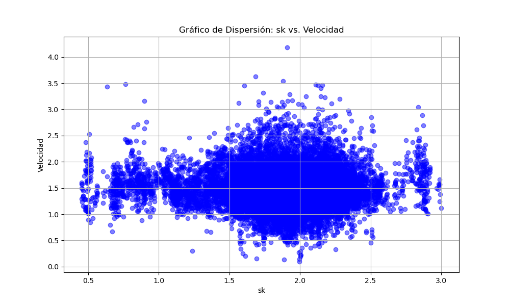

# Laboratorio 04: Cálculo de sk y vecinos más cercanos

## 1. Introducción 

El presente laboratorio se enfoca en los datos adquiridos del proyecto BaSiGo, respaldado por el Ministerio Federal de Educación e Investigación. La investigación indaga la dinámica de multitudes en entornos limitados, empleando detalles del archivo "UNI_CORR_500_01" que albergan las coordenadas de desplazamiento en los ejes X, Y y Z de los usuarios que formaron parte del estudio. El propósito es detectar patrones y tendencias en la movilidad, analizando velocidades, distancias recorridas por los peatones y su interacción con sus pares cercanos.

Se utiliza el modelo de ajuste paramétrico de Weidmann para anticipar cómo los peatones actúan en entornos que presentan configuraciones geométricas más complejas en comparación con los pasillos rectangulares típicos. Este modelo descansa en la distancia media euclidiana entre los vecinos más cercanos. El laboratorio tiene como propósito obtener los valores del parámetro "sk", así como otros parámetros para avanzar en el desarrollo del modelo. Además, se generan gráficos para visualizar los resultados y se obtienen conclusiones basadas en los hallazgos. Asimismo, se realiza una evaluación minuciosa del rendimiento de la unidad de procesamiento central al ejecutar los códigos empleados.

### 1.1 Justificación 

Este experimento brinda una oportunidad concreta para enfrentar desafíos relacionados con la congestión en áreas cerradas y altamente transitadas.
A través del análisis de datos, se puede comprender las dinámicas de congestión y localizar puntos críticos en sistemas, fortaleciendo así la capacidad de analizar y diseñar soluciones a partir de las herramientas proporcionadas por la ciencia de datos. Estos esfuerzos no solo optimizan la planificación de infraestructuras en ciertos espacios urbanos, sino que también tienen un impacto en la mejora de la seguridad de los peatones al identificar puntos de conflicto y patrones de movimiento.
 
Un aspecto crucial de esta investigación radica en la capacidad de calcular los parámetros del modelo de ajuste de Weidmann. Estos parámetros no solo brindan una comprensión más profunda de las interacciones y comportamientos de los peatones en entornos diversos, sino que también son esenciales para el éxito y la precisión del modelo en sí. Poder determinar con precisión los valores de estos parámetros permite una calibración más precisa del modelo, lo que a su vez potencia su capacidad para prever y representar los patrones de movimiento con mayor fidelidad. Esto, a su vez, refuerza la confiabilidad de las soluciones y recomendaciones derivadas del modelo, consolidando así su utilidad en la toma de decisiones y la planificación efectiva en la gestión del tráfico peatonal en áreas congestionadas.

### 1.2 Objetivos 

*Objetivo General*

Calcular las velocidades de los peatones en distintos espacios, 
Calcular los parámetros del modelo de ajuste de Weidmann, utilizando los datos del archivo "UNI_CORR_500_01.txt" y crear representaciones gráficas que faciliten la comprensión y análisis de los resultados obtenidos para una comprensión más profunda de las dinámicas de movilidad.

*Objetivos específicos*

1. Realizar un análisis exhaustivo de la base de datos para comprender su estructura y contenido.
2. Agrupar los registros de movimiento por peatón y por frame para facilitar el procesamiento y análisis individual.
3. Calcular las distancias recorridas por cada peatón entre fotogramas consecutivos y determinar el tiempo necesario para cada desplazamiento
4. Determinar las velocidades de desplazamiento de los peatones mediante el cálculo de la relación entre distancia y tiempo.
5. Determinar el parametro de sk para cada peatón y frame.
6. Generar gráficos visuales que representen de manera efectiva los parámetros obtenidos del modelo.

## 2. Marco teórico

A continuación, se presentan una serie de herramientas, estructuras y librerías que se utilizarán a lo largo del laboratorio:

Conda: Se usará para la gestión de paquetes, ya sea buscar, instalar, actualizar o eliminarlos. A su vez permitirá crear y gestionar entornos virtuales que contendrá las bibliotecas necesarias para un proyecto en específico.

Ipython: Permitirá que la programación mediante Python se vuelva más eficiente e interactiva, utilizando diversas bibliotecas de análisis de datos.

Visual Studio: Es el entorno de desarrollo integrado (IDE) a usar que permitirá editar, depurar y compilar códigos para su posterior análisis.

Numpy: Esta librería proporciona distintas operaciones numéricas, matriciales y arreglos multidimensionales. Además, permite realizar arreglos más eficientes que las listas tradicionales de Python.

Matplotlib: Se emplea la librería Matplotlib para crear histogramas que representan la distribución de las velocidades promedio en cada instancia. Además, se generaron gráficos de caja para visualizar la dispersión y la presencia de valores atípicos en las velocidades de los peatones.

Pandas: Se utilizará la librería Pandas para la manipulación y análisis de datos.Esta herramienta permitirá transformar la información en un dataframe y agrupar la información en base a una columna, lo que permitirá una mayor eficiencia en la limpieza, filtrado y transformación de datos antes de su visualización y análisis.

Scipy: La biblioteca Scipy brinda una amplia variedad de funciones y algoritmos para abordar problemas científicos y de ingeniería. Ofrece herramientas para optimización, álgebra lineal, integración, interpolación y más. . Además, incluye submódulos especializados como scipy.spatial para manipulación de datos espaciales 

Streamlit: Se empleará streamlit una biblioteca de Python creada con el propósito de simplificar la generación de aplicaciones web interactivas a partir de scripts de análisis de datos. Esta herramienta posibilita la transformación de datos y visualizaciones en aplicaciones interactivas sin la necesidad de contar con conocimientos profundos en desarrollo web. Su enfoque resulta ideal para compartir resultados de análisis y visualizaciones de datos de manera accesible y amigable, brindando una experiencia similar a la de interactuar con un panel de control (dashboard).

## 3. Materiales y métodos

Para el presente laboratorio, se han ejecutado diversas operaciones de análisis y visualización utilizando el lenguaje de programación Python en el entorno de Visual Basic. El código resultante puede dividirse en cinco etapas fundamentales:

Carga de Datos y Cálculo de Velocidades:
Inicialmente, se importaron las bibliotecas esenciales de Python, como Pandas, NumPy y Streamlit. Estas bibliotecas fueron utilizadas para llevar a cabo el análisis y la visualización de datos extraídos del archivo "UNI_CORR_500_01.txt". A través de Pandas, se realizó la carga y manipulación de los datos, extrayendo las columnas relacionadas con las coordenadas (X, Y, Z). Además, se definió la función "calculo_velocidad" que aprovecha las diferencias entre las coordenadas consecutivas para calcular las velocidades individuales. Estas velocidades se incorporaron como una nueva columna en el DataFrame principal.

Creación de Histograma de Velocidades y Uso de Streamlit:
Durante esta fase, la biblioteca Streamlit se convirtió en una herramienta fundamental. A través de la función st.write(), se generó una interfaz de usuario amigable que mostró un histograma. Dicho histograma visualizaba la frecuencia de las velocidades promedio, resultado del cálculo realizado en la etapa anterior. Este gráfico proporcionó una representación visual clara de las tendencias en las velocidades de los peatones.

Cálculo del Parámetro "sk" Utilizando KDTree:
En esta etapa, se aplicó la técnica KDTree((Árbol de K Dimensiones) de la biblioteca SciPy. Para cada Frame en el conjunto de datos se iteró a través de los individuos. Utilizando KDTree, una estructura de datos eficiente para la búsqueda de vecinos cercanos, se identificaron aquellos peatones que se encontraban a una distancia de hasta 3 unidades de cada individuo. Luego, se calculó el parámetro "sk" promediando las distancias euclidianas entre el individuo y sus vecinos cercanos. Este cálculo captura la interacción y la influencia espacial entre los peatones en función de su cercanía utíl para identificar a aquellos peatones cercanos a cada individuo . La información recopilada a partir de estos cálculos de "sk" se integra en el DataFrame mediante la creación de una nueva columna con el mismo nombre.

Generación de Gráfico de Dispersión "sk" vs. Velocidad:
En esta fase, se recurrió a las bibliotecas matplotlib.pyplot y Streamlit. La combinación de ambas permitió la creación de un gráfico de dispersión. El eje x representó el valor del parámetro "sk" calculado previamente, mientras que el eje y reflejó las velocidades promedio. Este gráfico brindó una representación visual de cómo la interacción entre los peatones (expresada en "sk") se correlaciona con sus velocidades de desplazamiento.

Almacenamiento de Resultados y Medición de Tiempo de Procesamiento:
Finalmente, los resultados obtenidos, incluidas las velocidades promedio y los valores de "sk", se registraron en un archivo de texto llamado "velocidades_01.txt" para su posterior análisis. Un aspecto crucial de esta etapa fue la implementación de funciones que miden el tiempo de procesamiento del código. Estas funciones proporcionaron una valiosa información sobre el tiempo necesario para ejecutar cada operación, lo que resulta esencial para futuras optimizaciones y mejoras de rendimiento en análisis subsiguientes.

## 4. Resultados obtenidos

 Luego de realizar, ejecutar y corroborar que el código funciona correctamente se obtienen los siguientes resultados en las métricas de rendimiento:

| Tipo de Experimento   | Tiempo de ejecucion (seg) |  Memoria residente utilizada (Mb) |
|-----------------------|---------------------------|-------------------------|
| Programa Uno (Lab04.py)|6.951038122177124 sg |       159.5078125  |

 Los resultados obtenidos del código y las representaciones visuales generadas proporcionan información significativa. En primer lugar, la ilustración uno, correspondiente al histograma derivado del archivo "UNI_CORR_500_01.txt", muestra una similitud marcada con una distribución normal, sugiriendo una posible correspondencia con este tipo de distribución.

En lo que respecta a las velocidades promedio de los peatones, se observa una concentración notable en el rango de 1.2 a 1.8 m/s. Esta tendencia se reafirma tanto en el gráfico de dispersión como en el cúmulo de puntos presentado en la ilustración 2.

El gráfico de dispersión proporciona una representación visual de las relaciones entre los valores de "sk", que básicamente representa el promedio de las distancias euclidianas entre peatones en un momento dado, y las velocidades de los peatones en el corredor. En el eje x del gráfico se encuentran los valores de "sk", mientras que en el eje y se representan las velocidades.

Los datos en el gráfico revelan una variación en los valores de "sk", que abarca desde alrededor de 0.435 u hasta casi 3 u. Esta amplia gama refleja las distintas distancias promedio entre los peatones en el entorno. No obstante, se destaca que la mayoría de los datos forman una línea horizontal densa alrededor de los valores de 1 a 2 en el eje de velocidades. Esto indica que existe una velocidad predominante en condiciones específicas de interacción entre peatones, independientemente de las diferencias en las distancias entre ellos.

Además, se aprecia un grupo de puntos concentrados en las regiones entre 1.5 y 2.5 en el eje x, y entre 1.0 y 2.0 en el eje y. Esta concentración sugiere que las velocidades de los peatones tienden a agruparse alrededor de estos valores específicos, lo que podría relacionarse con patrones de comportamiento comunes en el entorno del corredor.

Es relevante notar que, aunque existen algunos puntos aislados en el gráfico, estos no emergen de manera abrupta, sino que parecen difuminarse desde los grupos de puntos más densos. Asimismo, en la vertical generada desde el punto 0.5 en el eje x, se observa una serie de puntos que abarcan un rango de velocidades desde 0.8 m/s hasta 2.6 m/s. Esta agrupación podría indicar que, en esta región específica, donde la interacción entre peatones es moderada, las velocidades se mantienen relativamente constantes. Similarmente, en la vertical generada desde el punto 2.8 del eje x, se identifica otro grupo de puntos que podrían indicar una relación entre valores más altos de "sk" y velocidades consistentes en ese rango.

<figure>
  
  <figcaption>Ilustración 1: Histograma de velocidades promedio</figcaption>
</figure>

<figure>
  
  <figcaption>Ilustración 2: Gráfico de dispersión entre valores de sk y velocidades</figcaption>
</figure>

## 5. Conclusiones

Este estudio resalta cómo la programación, el análisis de datos y los gráficos están conectados y nos ayudan a entender cómo la gente se mueve. Analizar los datos nos muestra que es importante entender el lugar donde ocurren las cosas, y los gráficos nos ayudan a ver patrones en la manera en que la gente se comporta en lugares con mucha gente. Es clave considerar cómo la gente interactúa con su entorno para entender los resultados.

Usar dataframes y herramientas de diferentes bibliotecas, junto con crear gráficos con Matplotlib, ha demostrado ser una forma efectiva de analizar datos de forma clara y completa. Los gráficos nos ayudan a ver cómo se relacionan los números "sk" con las velocidades de la gente. Los patrones que identificamos nos muestran cómo la interacción entre la gente influye en sus velocidades, revelando áreas donde se agrupan y otras donde hay variación en cómo se mueven en espacios compartidos.

Finalmente, es importante destacar que este enfoque nos proporciona ideas valiosas que pueden aplicarse en diferentes situaciones de la vida real. 

