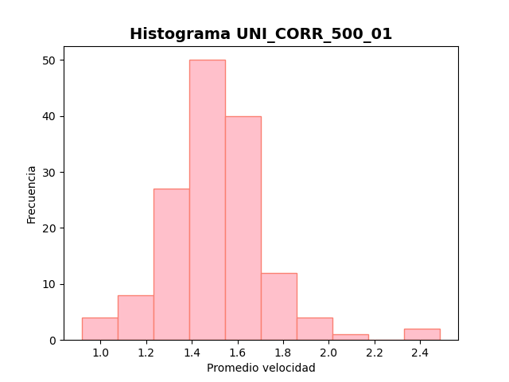

# Laboratorio 04: Cálculo de frecuencia peatonal 

## 1. Introducción 

El presente laboratorio se fundamenta en los datos adquiridos del proyecto BaSiGo, respaldado por el Ministerio Federal de Educación e Investigación (BMBF) en el programa de "Investigación para la Seguridad Civil", donde se llevaron a cabo nueve carreras con ajustes en la cantidad de individuos en corredores y los anchos (b_1 y b_2) de los pasillos.

Los archivos "UNI_CORR_500_01" y "UNI_CORR_500_07", obtenidos del mencionado proyecto, documentan las coordenadas de movimiento en los ejes X, Y y Z de los usuarios. El enfoque de la investigación se centraliza en la identificación de patrones, rutas y tendencias en la movilidad de multitudes en entornos limitados, siendo un análisis crucial para la mejora de la seguridad en eventos masivos. 

Asimismo, se procederá a visualizar las velocidades de los peatones mediante la creación de histogramas y gráficos de caja, lo cual permitirá una comprensión más exhaustiva de las variaciones en las velocidades en diversas situaciones. Además, se llevará a cabo una evaluación del uso de la unidad de procesamiento central (CPU) al ejecutar los códigos pertinentes.

### 1.1 Justificación 

Este experimento brinda una oportunidad concreta para enfrentar desafíos relacionados con la congestión en áreas cerradas y altamente transitadas.
A través del análisis de datos, se puede comprender las dinámicas de congestión y localizar puntos críticos en sistemas, fortaleciendo así la capacidad de analizar y diseñar soluciones a partir de las herramientas proporcionadas por la ciencia de datos. Estos esfuerzos no solo optimizan la planificación de infraestructuras en ciertos espacios urbanos, sino que también tienen un impacto en la mejora de la seguridad de los peatones al identificar puntos de conflicto y patrones de movimiento.
 
Además, esta comprensión detallada de los flujos peatonales tiene una consecuencia directa en el manejo de espacios públicos claves, como por ejemplo las estaciones de metro. Esta mejora se traduce en una experiencia más fluida y satisfactoria para los usuarios, además al analizar la velocidad de los peatones, se obtiene una perspectiva cuantitativa de cómo se desplazan las personas en áreas cerradas lo que ayuda a identificar posibles cuellos de botella o áreas de congestión.

### 1.3 Objetivos 

*Objetivo General*

Calcular las velocidades de los peatones en distintos espacios, y crear representaciones gráficas que faciliten la comprensión y análisis de los resultados obtenidos.

*Objetivos específicos*

1. Realizar un análisis exhaustivo de la base de datos para comprender su estructura y contenido.
2. Agrupar los registros de movimiento por peatón para facilitar el procesamiento y análisis individual.
3. Calcular las distancias recorridas por cada peatón entre fotogramas consecutivos y determinar el tiempo necesario para cada desplazamiento
4. Determinar las velocidades de desplazamiento de los peatones mediante el cálculo de la relación entre distancia y tiempo.
5. Generar gráficos visuales que representen de manera efectiva los patrones de comportamiento de las velocidades de los peatones.

## 2. Marco teórico

A continuación, se presentan una serie de herramientas, estructuras y librerías que se utilizarán a lo largo del laboratorio:

Conda: Se usará para la gestión de paquetes, ya sea buscar, instalar, actualizar o eliminarlos. A su vez permitirá crear y gestionar entornos virtuales que contendrá las bibliotecas necesarias para un proyecto en específico.

Ipython: Permitirá que la programación mediante Python se vuelva más eficiente e interactiva, utilizando diversas bibliotecas de análisis de datos.

Visual Studio: Es el entorno de desarrollo integrado (IDE) a usar que permitirá editar, depurar y compilar códigos para su posterior análisis.

Numpy: Esta librería proporciona distintas operaciones numéricas, matriciales y arreglos multidimensionales. Además, permite realizar arreglos más eficientes que las listas tradicionales de Python.

Matplotlib: Se emplea la librería Matplotlib para crear histogramas que representan la distribución de las velocidades promedio en cada instancia. Además, se generaron gráficos de caja para visualizar la dispersión y la presencia de valores atípicos en las velocidades de los peatones.

Pandas: Se utilizará la librería Pandas para la manipulación y análisis de datos.Esta herramienta permitirá transformar la información en un dataframe y agrupar la información en base a una columna, lo que permitirá una mayor eficiencia en la limpieza, filtrado y transformación de datos antes de su visualización y análisis. 

## 3. Materiales y métodos

Para la realización del laboratorio, se emplean dos conjuntos de datos identificados como "UNI_CORR_500_01.txt" y "UNI_CORR_500_07.txt". Cada archivo de texto contiene cinco columnas, las dos primeras corresponden a identificadores y las tres restantes representan las coordenadas (X, Y y Z) que serán procesadas. Estas coordenadas son valores de tipo float.

En el proceso de análisis, se importaron bibliotecas esenciales: Pandas para el manejo de datos, NumPy para cálculos numéricos, Matplotlib para la visualización de gráficos y la función sqrt (raíz cuadrada) del módulo math. Se comenzó por definir una función que calcula la velocidad de los peatones. Esta función determinó la distancia recorrida mediante la fórmula euclidiana, considerando las diferencias entre las coordenadas actuales y las anteriores. Además, se empleó la columna "Frame" para calcular el intervalo de tiempo basado en una frecuencia de 25 cuadros por segundo (fps). Posteriormente, se dividió la distancia entre el tiempo para obtener las velocidades en cada intervalo.

A continuación, se procedió a cargar los datos y crear un DataFrame que se agrupó según la columna "# PersID". La función de cálculo de velocidad se aplicó utilizando el método "apply", lo que dio lugar a un nuevo DataFrame con velocidades calculadas para cada peatón en distintos momentos.

Seguidamente, se calculó el promedio de velocidad para cada identificador en el DataFrame. Este enfoque proporcionó una visión global de las tendencias de velocidad entre los peatones, y se utilizó para generar histogramas que representan la distribución de los promedios de velocidad.

Finalmente, se generaron gráficos de caja y bigotes para 10 peatones, los cuales resumieron la información de todas sus velocidades a lo largo del tiempo. Para este paso, se eliminaron los valores NaN (sin referencia previa) a fin de evitar inconvenientes. Estos gráficos se generaron para ambos conjuntos de datos, completando así el análisis de manera integral.

## 4. Resultados obtenidos

Luego de realizar, ejecutar y corroborar que el código funciona correctamente se obtienen los siguientes resultados en las métricas de rendimiento:

| Tipo de Experimento   | Tiempo de ejecucion (seg) |  Memoria utilizada (Mb) |
|-----------------------|---------------------------|-------------------------|
| Programa Uno (Lab03.py)|0.7631428241729736 |       116.921875   |
| Programa Dos (Lab03.py)|2.2850022315979004   |       127.98046875   |

El análisis de las tablas resalta que el Programa Uno ("UNI_CORR_500_01.txt)ofrece un mejor rendimiento en términos de tiempo de ejecución y uso de memoria en comparación con el Programa Dos("UNI_CORR_500_07.txt), a pesar de que ambos programas realizan las mismas operaciones pero en ejemplos de conjuntos de datos diferentes. Estos resultados sugieren que el enfoque del Programa Uno podría ser más óptimo en términos de eficiencia y rendimiento para aplicaciones similares en el futuro, es decir en aplicaciones donde hay menos peatones.

En cuanto a las representaciones gráficas, el primer histograma derivado del archivo "UNI_CORR_500_01.txt" muestra similitudes marcadas con una distribución normal, sugiriendo una posible correspondencia con este tipo de distribución. Por otro lado, el segundo archivo presenta una forma que se aleja de la normalidad, sugiriendo posibles distribuciones como exponencial o geométrica. Será necesario realizar ajustes para determinar la distribución más adecuada a los datos.

En relación a las velocidades promedio de peatones, en el programa 1 se observa una concentración en el rango de 1.2 a 1.8 m/s. En contraste, en el programa 2, prevalecen velocidades más bajas, entre 0.2 y 0.4 m/s. Esto podría deberse a restricciones de espacio en el segundo entorno, causando congestión y limitando la circulación independiente de las personas.

En las gráficas de cajas y bigotes, el programa 1 muestra más valores atípicos, posiblemente debido a obstáculos que generan cambios abruptos en la velocidad. Las medianas oscilan entre 1.3 y 1.8 m/s, con variaciones en las cajas pero sin diferencias significativas. En el programa 2, las cajas son más homogéneas, reforzando la idea de congestión y similitud en velocidades. Las medias rondan los 1.5 m/s y las cajas son más cortas que en el programa 1. Es posible que estas diferencias se relacionen con la dinámica y el entorno de cada archivo.

## 5. Conclusiones

El análisis efectuado demuestra la importancia de considerar las particularidades del entorno al interpretar los datos de velocidad de peatones. A su vez, se ha enfatizado la utilidad de las herramientas analíticas y de visualización para comprender los patrones de comportamiento en contextos específicos. 
La programación, el análisis de datos y la visualización gráfica nos ha dado ideas importantes que se pueden usar en muchas situaciones diferentes. Por ejemplo, estas ideas pueden ser útiles al organizar cómo se diseñan lugares o cómo se controla la cantidad de personas que pasan por un lugar. También pueden ser útiles para pensar en cómo manejar el tráfico o cómo hacer que las cosas sean más seguras en diferentes situaciones.

Respecto al análisis de las distribuciones de velocidad realizado, se observa que el primer conjunto de datos presenta una distribución similar a una normal, mientras que el segundo muestra una forma que se desvía de la normalidad, sugiriendo posibles distribuciones exponenciales o geométricas. También se notan diferencias en las velocidades promedio de los peatones en ambos programas, lo que podría indicar influencias del entorno en el comportamiento de los peatones.

Es destacable la eficacia de la combinación de dataframes con las funciones de diversas bibliotecas utilizadas, así como la capacidad de crear gráficos mediante Matplotlib, lo que permite realizar análisis tanto concisos como exhaustivos.

